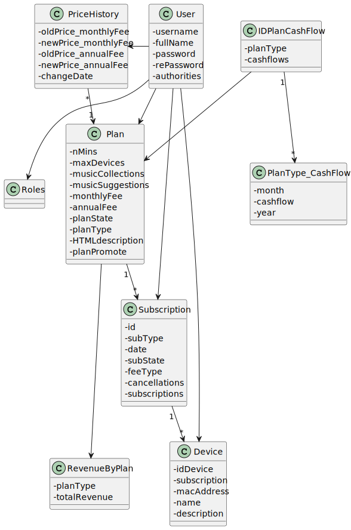
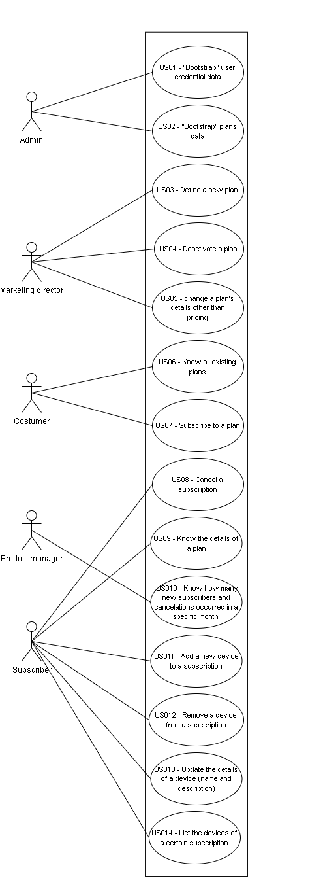
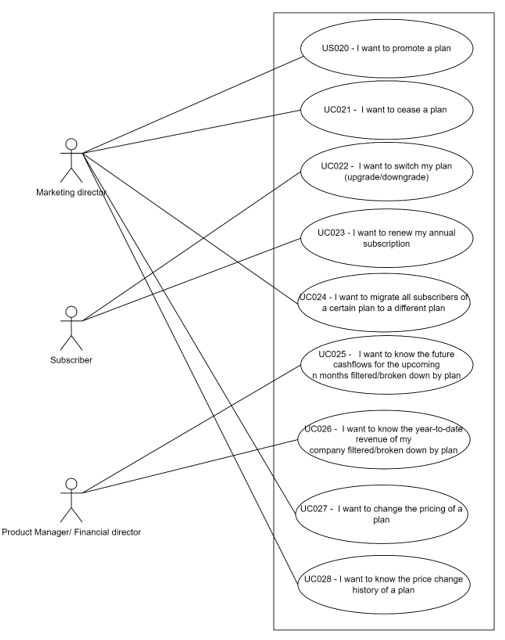

# Main documentation

## 1. Context/Problem

> ACME, Inc. is a SaaS-based music streaming service and wants to develop a service-oriented solution to manage the subscriptions of the service and collect some important metrics. The company offers several plans and needs the ability to create new plans to adapt to market. Due to marketing reasons, the company wants to be able to promote a plan, that is, give a highlight to a
  certain plan, for example, by rendering it on the web page with a different layout that gives it more screen
  area than the others. Plans can also be deactivated or ceased. A deactivated plan is one that no longer is available for subscription but remains
  enforce for current active subscribers of such plan. A plan can only be ceased if there are no current
  subscribers of such plan. Usually, the company migrates the subscribers to a different plan prior to ceasing
  it.
  A customer can subscribe to the service by selecting a plan and paying for the annual or monthly fee. This
  entitles the customer to listen to up to n minutes of music on the number of devices according to the plan
  they selected. Other features are also dependent on the selected plan. Furthermore, the company wants to know some metrics to manage the business. Namely, the company
> needs to track: All the revenue generated so far, Future cash flows based on currently active subscriptions, Active subscriptions, Monthly new subscriptions, Monthly canceled subscriptions and the Churn rate

## 2. Domain Model

Here we can see our domain model:

## 3. Functional Requirements

Here we can see the functionalities of the application:

## 4. APIs

In our project, we utilized 4 APIs. One of them was used 
to retrieve the funny quote of the day, while the other 
three were utilized to obtain the weather forecast based 
on the user's location. Below, we have provided the 
documentation and respective websites for all four APIs:

> Funny quote of the day: https://api-ninjas.com/api/quotes

To retrieve the funny quote, we made a GET request to the 
provided URL and stored the response (in this case, the 
funny quote) in a variable named "funnyQuote". To access 
this API, an API-Key is required, which is generated upon 
creating an account on the website.

> *Get the weather forecast based on the location*
> 
> Get the IP Address of the user: https://icanhazip.com
> 
> Get the Longitude and Latitude: https://www.ip2location.io
> 
> Get the weather forecast: https://www.weatherapi.com

We successfully utilized these APIs to acquire the required
longitude and latitude data, enabling us to access the 
weather forecast API and retrieve the desired weather 
information. Initially, we obtained the machine's IP 
address using the first API. Then, using the stored IP 
address, we retrieved the corresponding longitude and 
latitude with the second API. Finally, with the obtained 
coordinates, we accessed the weather forecast API to 
retrieve the desired weather information. In the response,
we get a lot of information about the current weather (like
wind speed, temperature, humidity, etc.). So, we stored just
some useful information about the current weather.

The API to get the longitude and latitude and the API to 
get the weather information used API-keys. Those keys can 
be generated in their respective website upon creating 
an account on their respective websites.

> Note: All these APIs are free to use

## 5. Observations

n/a

