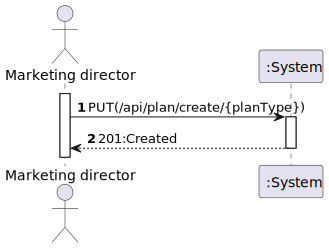
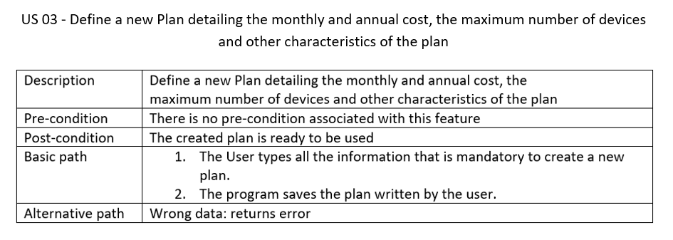
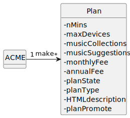
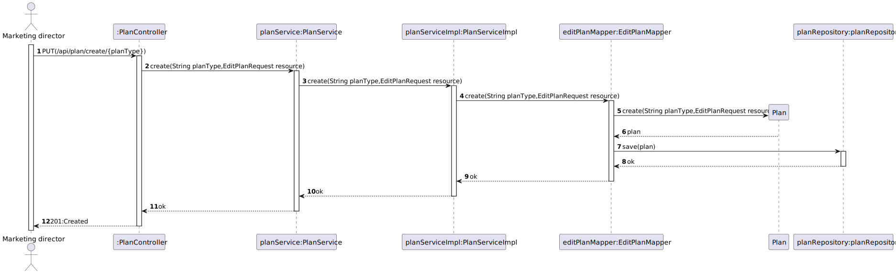
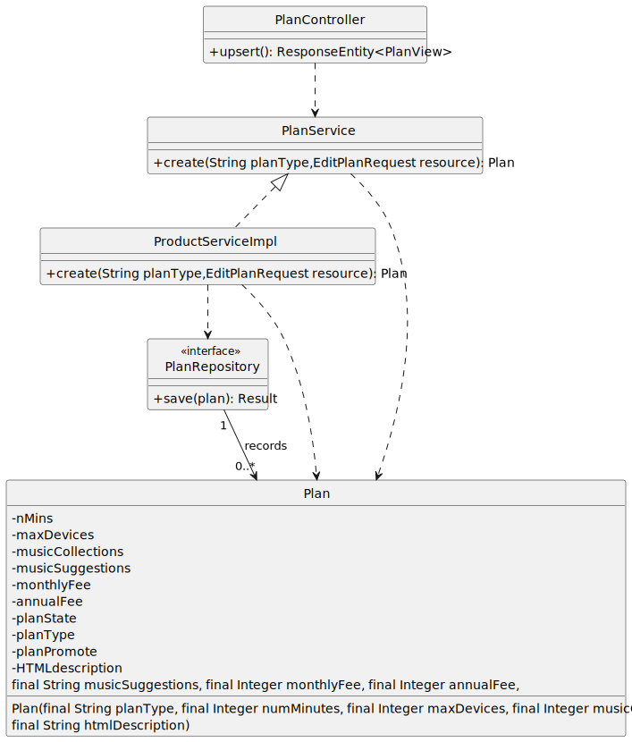

# US 03 - Define a new Plan detailing the monthly and annual cost, the maximum number of devices and other characteristics of the plan

## 1. Requirements Engineering

### 1.1. User Story Description

- As Marketing director, I want to define a new Plan detailing the monthly and annual cost, the
  maximum number of devices and other characteristics of the plan

  

### 1.2. Customer Specifications and Clarifications

**From the specifications document:**

> "The company offers several plans and needs the ability to create new plans to adapt to market."

**From the client clarifications:**

> **Question:**  "Boa tarde, gostaria de saber se o número máximo de dispositivos apresentado na tabela dos planos corresponde ao número máximo de dispositivos que é possível associar à conta/user ou se este número corresponde ao limite de dispositivos ligados ao mesmo tempo à conta/user.
Cumprimentos"
> **Answer:**"boa tarde, corresponde ao número máximo de dispositivos associados com a conta"

> **Question:**  "Bom dia, gostaria de saber quais sao os criterios de aceitaçao em relaçao a Us 3."
Cumprimentos.
> **Answer:** "boa tarde,
As Marketing director, I want to define a new Plan detailing the monthly and annual cost, the maximum number of devices and other characteristics of the plan
the user must be able to enter the plan name, a brief description as HTML text, the monthly and annual cost of the plan, the maximum number of devices, the maximum number of collections, if it includes music suggestion, and the number of included minutes. All of this information is mandatory. The plan name must be be unique."
### 1.3. Acceptance Criteria

* Plans should have different names (PlanType).

### 1.4. Found out Dependencies

* n/a

### 1.5 Input and Output Data

**Input Data:**

* Typed data:
  * nMins
  * maxDevices
  * musicCollections
  * musicSuggestions
  * monthlyFee
  * annualFee
  * planType
  * HTMLdescription
* Selected data:
    * n/a

**Output Data:**

* (In)Success of the operation

### 1.6. System Sequence Diagram (SSD)

### 1.7. Functionality

## 2. OO Analysis

### 2.1. Relevant Domain Model Excerpt

### 2.2. Other Remarks

n/a

## 3. Design - User Story Realization

## 3.1. Sequence Diagram (SD)

## 3.2. Class Diagram (CD)

# 4. Tests

**Test 1:** ensure NameType is not null

   	@Test
	void ensureNameTypeMustNotBeNull() {
		assertThrows(IllegalArgumentException.class, () -> new Plan(null,1000, 3, 5, "Automatic", 10, 100, "ola a todos"));
	}

**Test 2:** ensure NameType is not Blank

	@Test
	void ensureNameMustNotBeBlank() {
		assertThrows(IllegalArgumentException.class, () -> new Plan("",1000, 3, 5, "Automatic", 10, 100, "ola a todos"));
	}

**Test 3:** ensure NameType does not have blank spaces

	@Test
	void ensureNameMustNotBeBlankSpaces() {
		assertThrows(IllegalArgumentException.class, () -> new Plan("     ",1000, 3, 5, "Automatic", 10, 100, "ola a todos"));
	}

**Test 4:** ensure NameType is set

	@Test
	void ensureNameIsSet() {
		final var subject = new Plan("Silver", 1000, 3, 5, "Automatic", 10, 100, "ola a todos");
		assertEquals("Silver", subject.getPlanType());
	}
**Test 5:** ensure plan attributes is set
	
    @Test
	void ensurePlanAttributesSet() {
		final var subject = new Plan("Silver", 1000, 3, 5, "Automatic", 10, 100, "ola a todos");
		subject.setPlanState(PlanStatus.DEACTIVATED);
		assertEquals("Silver", subject.getPlanType());
		assertEquals(Integer.valueOf(1000), subject.getNumMinutes());
		assertEquals(Integer.valueOf(3), subject.getMaxDevices());
		assertEquals(Integer.valueOf(5), subject.getMusicCollections());
		assertEquals("Automatic", subject.getMusicSuggestions());
		assertEquals(Integer.valueOf(10), subject.getMonthlyFee());
		assertEquals(Integer.valueOf(100), subject.getAnnualFee());
		assertEquals("ola a todos", subject.getHtmlDescription());
		assertEquals(PlanStatus.DEACTIVATED, subject.getPlanState());
		assertEquals(PlanPromote.NOT_PROMOTED, subject.getPlanPromote());
	}

# 5. Tests Postman
**Test 1:** Verify if the plan was created - PUT

    pm.test(
    "US03 - Create new plan",
    function(){
    pm.response.to.have.status(201);
    }
    );

**Test 2:** Verify if the plan was created with the correct attributes and values - GET

    pm.test(
    function(){
    pm.response.to.have.status(200);
    }
    );
    pm.test(
    "Check if exists four plans",
    function(){
    var jsonData = pm.response.json();
    pm.expect(jsonData.length).to.eql(4);
    }
    );
    pm.test("Check if attributes  are equal (for plan iron)", function(){
    var jsonData = pm.response.json();
    var expectedNumMinutes = 100300;
    var expectedMaxDevices = 531;
    var expectedMusicCollections = 511;
    var expectedMusicSuggestions = "123123455553";
    var expectedMonthlyFee = 55.0;
    var expectedAnnualFee = 5430.0;
    var expectedHtmlDescription = "Emerald p213123la213n";
    var expectedPlanState = "ACTIVATED";
    var expectedPlanPromote = "NOT_PROMOTED";
    var targetPlanId = "Iron";

    var targetPlan = jsonData.find(function(plan){
        return plan.planType === targetPlanId;
    });

    pm.expect(targetPlan.numMinutes).to.eql(expectedNumMinutes);
    pm.expect(targetPlan.maxDevices).to.eql(expectedMaxDevices);
    pm.expect(targetPlan.musicCollections).to.eql(expectedMusicCollections);
    pm.expect(targetPlan.musicSuggestions).to.eql(expectedMusicSuggestions);
    pm.expect(targetPlan.monthlyFee).to.eql(expectedMonthlyFee);
    pm.expect(targetPlan.annualFee).to.eql(expectedAnnualFee);
    pm.expect(targetPlan.htmlDescription).to.eql(expectedHtmlDescription);
    pm.expect(targetPlan.planState).to.eql(expectedPlanState);
    pm.expect(targetPlan.planPromote).to.eql(expectedPlanPromote);
    });

**Test 3:** Verify that HTMLDescription is not null, nor blank - PUT

    pm.test(
    "HTMLDescription must not be null, nor blank",
    function(){
    pm.response.to.have.status(400);
    }
    );

**Test 4:**  Verify that palns must have different names - PUT

    pm.test(
    "The identity of the object you tried to create is already in use",
    function(){
    pm.response.to.have.status(409);
    }
    );
  
# 6. Observations
n/a

