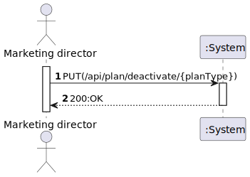
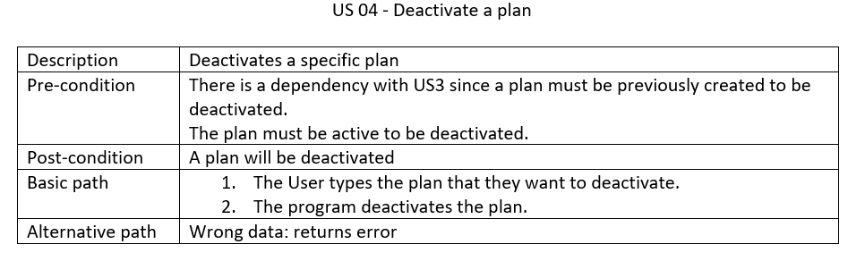
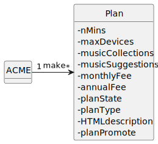
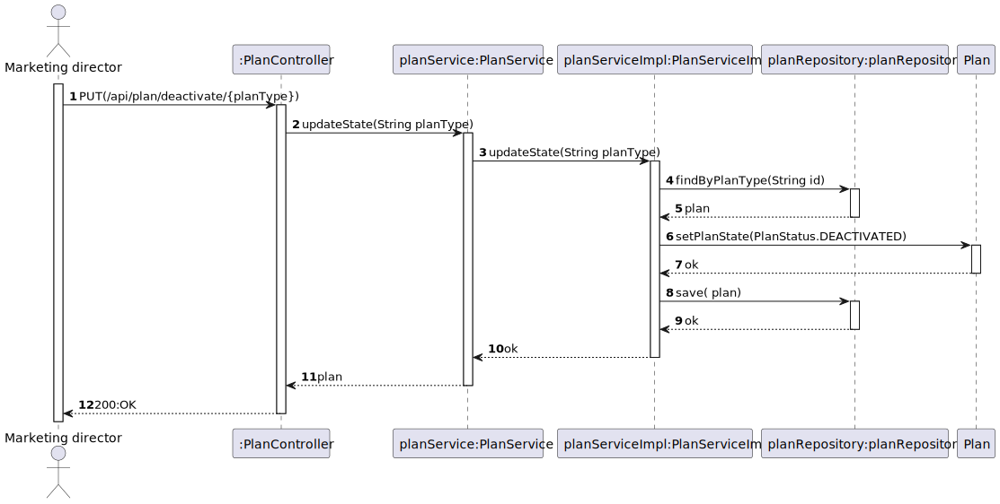
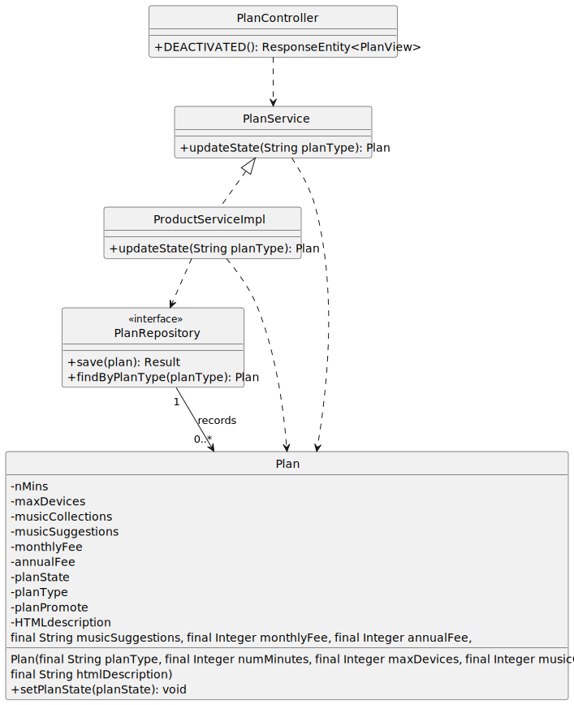

# US 04 - Deactivate a plan

## 1. Requirements Engineering

### 1.1. User Story Description

- As marketing director, I want to deactivate a plan.

### 1.2. Customer Specifications and Clarifications

**From the specifications document:**

> "Plans can also be deactivated or ceased.A deactivated plan is one that no longer is available for subscription but remains
inforce for current active subscribers of such plan."

**From the client clarifications:**

> **Question:**  "
Boa noite,
Gostaria de saber, relativamente à US04, se desativar um plano significa removê-lo do sistema ou não?"
> **Answer:**"bom dia,
desativar um plano significa que esse plano já não está disponivel para novas subscrições, mas no entanto mantém-se em vigor para os clientes atuais do mesmo"

### 1.3. Acceptance Criteria
* The plan should be in a previous different state other than deactivated!

### 1.4. Found out Dependencies

* There is a dependency with [US03](../US03/US03.md) since a Plan must be previously created to be  deactivated!

### 1.5 Input and Output Data

**Input Data:**

* Typed data:
    * The PlanType(code) to be deactivated

* Selected data:
    * n/a

**Output Data:**

* (In)Success of the operation

### 1.6. System Sequence Diagram (SSD)

### 1.7. Functionality

## 2. OO Analysis

### 2.1. Relevant Domain Model Excerpt

### 2.2. Other Remarks

n/a

## 3. Design - User Story Realization

## 3.1. Sequence Diagram (SD)

## 3.2. Class Diagram (CD)

# 4. Tests

**Test 1:** ensure plan is deactivated

	@Test
	void ensurePlanCanBeDeactivated() {
		final var subject = new Plan("Silver", 1000, 3, 5, "Automatic", 10, 100, "ola a todos");
		assertEquals(PlanStatus.ACTIVATED, subject.getPlanState());
		subject.setPlanState(PlanStatus.DEACTIVATED);
		assertEquals(PlanStatus.DEACTIVATED, subject.getPlanState());
	}

# 5. Tests Postman

**Test 1:**  deactivated  plan - PUT

    pm.test(
    "US04 -DEACTIVATE A PLAN",
    function(){
    pm.response.to.have.status(200);
    }
    );

**Test 2:**  deactivated  plan again error - PUT
    
    pm.test(
    "US03 -DEACTIVATE the same PLAN",
    function(){
    pm.response.to.have.status(400);
    }
    );

**Test 2:**  verify if plan is deactivated - GET

    pm.test(
    "US02 - bootstrap plans data",
    function(){
    pm.response.to.have.status(200);
    }
    );
    
    pm.test(
    "Check if attributes are equal (for plan Iron)",
    function(){
    var jsonData = pm.response.json();

        var expectedplanState="DEACTIVATED";

        var targetPlanId = "Iron"; 
        
        var targetPlan = jsonData.find(function(plan){
            return plan.planType === targetPlanId;
        });
    

                pm.expect(targetPlan.planState).to.eql(expectedplanState);

    }
    );

# 6. Observations
n/a

