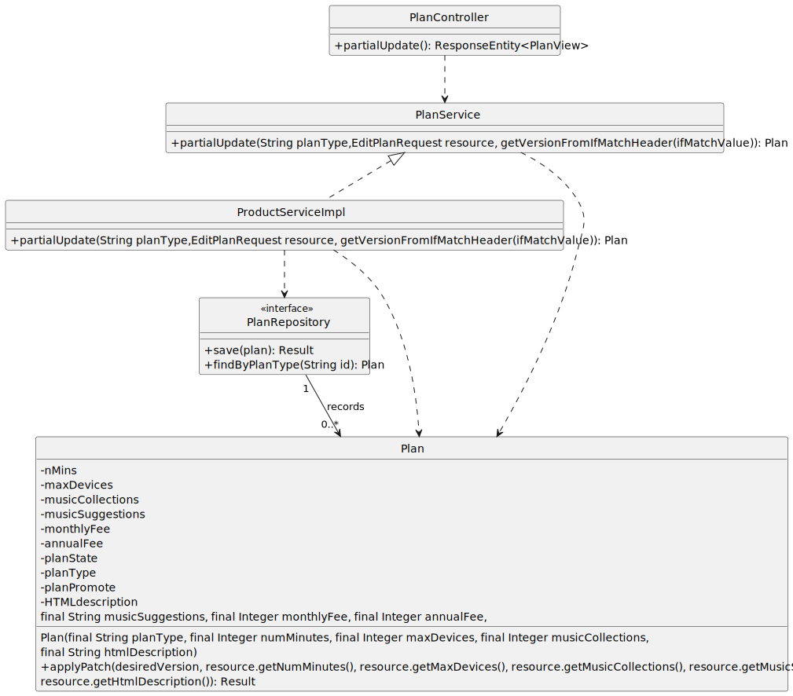

# US 05 - To update  a plan’s details other than pricing.

## 1. Requirements Engineering

### 1.1. User Story Description

- As marketing director, I want to change a plan’s details other than pricing.

  

### 1.2. Customer Specifications and Clarifications

**From the specifications document:**

> "The company offers several plans and needs the ability to create new plans to adapt to market."

**From the client clarifications:**

> **Question:**  "
Boa noite, poderia indicar quais são os critérios de aceitação referentes à US 5 por favor ?
Cumprimentos."
> **Answer:**"
boa tarde,
o diretor de marketing pode atualizar qualquer um dos atributos do plano excepto o seu nome e o preço do mesmo"

> **Question:**  "
Boa tarde , na US5 gostaria de saber se o cliente também pode mudar o estado do plano, ou seja, por um plano desativado, como no US4. Já agora gostaria de também de saber se um plano que foi desativado pode voltar a ser ativado."
> **Answer:**"
boa tarde,
US4 e US5 são duas user stories diferentes.
US4 desativar um plano apenas faz a desativação do plano
US5 alterar caracteristicas do plano excepto preço. não altera o facto do plano estar ativo ou não.
um plano desativado será no futuro terminado "ceased" mas não é posisvel voltar a estar ativo"

### 1.3. Acceptance Criteria
* Not-Provided
* No implicit AC were found

### 1.4. Found out Dependencies

* There is a dependency with [US03](../US03/US03.md) since a Plan must be previously created to be  updated!

### 1.5 Input and Output Data

**Input Data:**

* Typed data:
  * nMins
  * maxDevices
  * musicCollections
  * musicSuggestions
  * HTMLdescription

**Output Data:**

* (In)Success of the operation

### 1.6. System Sequence Diagram (SSD)

### 1.7. Functionality

## 2. OO Analysis

### 2.1. Relevant Domain Model Excerpt

### 2.2. Other Remarks

n/a

## 3. Design - User Story Realization

## 3.1. Sequence Diagram (SD)

## 3.2. Class Diagram (CD)

# 4. Tests
**Test 1:** when Version Is Staled It Is Not Possible To Patch
  	
    @Test
	void whenVersionIsStaledItIsNotPossibleToPatch() {
		final var patch = new EditPlanRequest(10, null,null, null, null, null, null);
		final var subject = new Plan("Silver", 1000, 3, 5, "Automatic", 10, 100, "ola a todos");

		assertThrows(StaleObjectStateException.class,
				() -> subject.applyPatch(999, patch.getNumMinutes(), patch.getMaxDevices(), patch.getMusicCollections(), patch.getMusicSuggestions(), patch.getHtmlDescription()));
	}
**Test 2:** ensure Patch Name Is Ignored

	@Test
	void ensurePatchNameIsIgnored() {
		final var patch = new EditPlanRequest(10, null,null, null, null, null, null);
		final var subject = new Plan("Silver", 1000, 3, 5, "Automatic", 10, 100, "ola a todos");

		subject.applyPatch(subject.getVersion(), patch.getNumMinutes(), patch.getMaxDevices(), patch.getMusicCollections(), patch.getMusicSuggestions(), patch.getHtmlDescription());

		assertEquals("Silver", subject.getPlanType());
	}
**Test 3:** test ensures that the applyPatch() method is correctly placed
  
    @Test
    void ensurePatchmaxDivices() {
    final var patch = new EditPlanRequest(10, 50,null, null, null, null, null);
  
          final var subject = new Plan("Silver", 1000, 3, 5, "Automatic", 10, 100, "ola a todos");
          subject.setMaxDevices(99);
  
          subject.applyPatch(0, patch.getNumMinutes(), patch.getMaxDevices(), patch.getMusicCollections(), patch.getMusicSuggestions(), patch.getHtmlDescription());
  
          assertEquals(Integer.valueOf(50), subject.getMaxDevices());
      }

	@Test
	void ensurePatchnumMinutes() {
		final var patch = new EditPlanRequest(10, null,null, null, null, null, null);

		final var subject = new Plan("Silver", 1000, 3, 5, "Automatic", 10, 100, "ola a todos");
		subject.setNumMinutes(99);

		subject.applyPatch(0, patch.getNumMinutes(), patch.getMaxDevices(), patch.getMusicCollections(), patch.getMusicSuggestions(), patch.getHtmlDescription());

		assertEquals(Integer.valueOf(10), subject.getNumMinutes());
	}

# 5. Tests Postman

**Test 1:** Update Plan

    pm.test(
    "US05 - update plans data",
    function(){
    pm.response.to.have.status(200);
    }
    );

**Test 2:** Verify if the plan was updated - GET

    pm.test(
    "Verify UPDATED Plan",
    function(){
    pm.response.to.have.status(200);
    }
    );
    
    pm.test(
    "Check  attributes (for plan Iron)",
    function(){
    var jsonData = pm.response.json();
    var expectedNumMinutes = 111;
    var expectedmaxDevices = 10;
    var expectedmusicCollections = 7;
    var expectedmusicSuggestions = "Automatic_Style";
    var expectedhtmlDescription = "Homeless people";
    var targetPlanId = "Iron";

        var targetPlan = jsonData.find(function(plan){
            return plan.planType === targetPlanId;
        });
    
        pm.expect(targetPlan.numMinutes).to.eql(expectedNumMinutes);
        pm.expect(targetPlan.maxDevices).to.eql(expectedmaxDevices);
        pm.expect(targetPlan.musicCollections).to.eql(expectedmusicCollections);
        pm.expect(targetPlan.musicSuggestions).to.eql(expectedmusicSuggestions);

        pm.expect(targetPlan.htmlDescription).to.eql(expectedhtmlDescription);
    }
    );

**Test 3:** checks that the user cannot change fees - PATCH

    pm.test(
    "You can't change the fees of a plan",
    function(){
    pm.response.to.have.status(500);
    }
    );

**Test 4:** checks object was updated by another user - PATCH

    pm.test(
    "Object was updated by another user",
    function(){
    pm.response.to.have.status(409);
    }
    );

# 6. Observations

n/a
