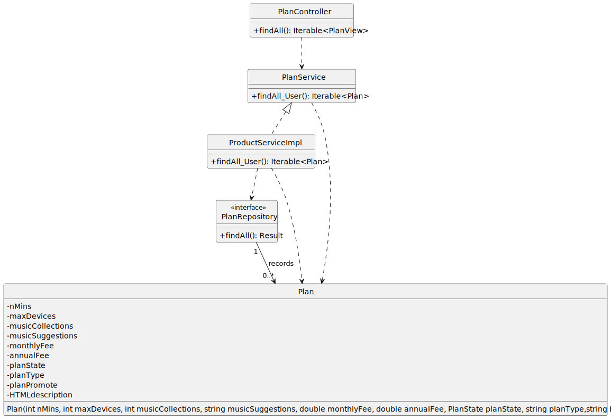

# US 06 - To list all plans

## 1. Requirements Engineering

### 1.1. User Story Description

- As a new customer I want to know all existing plans

### 1.2. Customer Specifications and Clarifications

**From the specifications document:**

> "The company offers several plans and needs the ability to create new plans to adapt to market."

**From the client clarifications:**

> **Question:**  "Boa tarde, na US6, quais devem ser as informações do plano que devem ser mostradas ao cliente?
Assumo que sejam:
-Preço Anual, Preço Mensal, Número de minutos, Nº Max Dispositivos, Nº Coleções musicas, Recomendações musicais
Devo acrescentar algum? "
> **Answer:**"boa tarde,
deve também mostrar se é um plano promovido ou não"

### 1.3. Acceptance Criteria
* No implicit AC were found

### 1.4. Found out Dependencies

* No dependencies were found.
* However, plans must be previously created ([US03](../US03/US03.md))
### 1.5 Input and Output Data

**Input Data:**

* Typed data:
  * n/a

* Selected data:
  * n/a

**Output Data:**

* List of Plans

### 1.6. System Sequence Diagram (SSD)

### 1.7. Functionality

## 2. OO Analysis

### 2.1. Relevant Domain Model Excerpt

### 2.2. Other Remarks

n/a

## 3. Design - User Story Realization

## 3.1. Sequence Diagram (SD)

## 3.2. Class Diagram (CD)

# 5. Tests Postman
**Test 1:** Verify that boostrap plans data is working correctly - GET

    pm.test(
    "US02 - bootstrap plans data",
    function(){
    pm.response.to.have.status(200);
    }
    );
    pm.test(
    "Check that there are already three plans",
    function(){
    var jsonData = pm.response.json();
    pm.expect(jsonData.length).to.eql(3);
    }
    );
    pm.test(
    "Check if attributes in boostrat are equal (for plan free)",
    function(){
    var jsonData = pm.response.json();
    var expectedNumMinutes = 1000;
    var expectedmaxDevices = 1;
    var expectedmusicCollections = 0;
    var expectedmusicSuggestions = "automatic";
    var expectedmonthlyFee = 0.00;
    var expectedannualFee = 0.00;
    var expectedhtmlDescription = "Free Plan";
    var expectedplanState = "ACTIVATED";
    var targetPlanId = "Free";

        var targetPlan = jsonData.find(function(plan){
            return plan.planType === targetPlanId;
        });
    
        pm.expect(targetPlan.numMinutes).to.eql(expectedNumMinutes);
        pm.expect(targetPlan.maxDevices).to.eql(expectedmaxDevices);
        pm.expect(targetPlan.musicCollections).to.eql(expectedmusicCollections);
        pm.expect(targetPlan.musicSuggestions.toLowerCase()).to.eql(expectedmusicSuggestions.toLowerCase());
        pm.expect(targetPlan.monthlyFee).to.eql(expectedmonthlyFee);
        pm.expect(targetPlan.annualFee).to.eql(expectedannualFee);
        pm.expect(targetPlan.htmlDescription).to.eql(expectedhtmlDescription);
        pm.expect(targetPlan.planState).to.eql(expectedplanState);
    }
    );
    
    pm.test(
    "Check if attributes in boostrat are equal (for plan Silver)",
    function(){
    var jsonData = pm.response.json();
    var expectedNumMinutes = 5000;
    var expectedmaxDevices = 3;
    var expectedmusicCollections = 10;
    var expectedmusicSuggestions = "Automatic";
    var expectedmonthlyFee = 4.99;
    var expectedannualFee = 49.99;
    var expectedhtmlDescription = "Silver Plan"
    var expectedplanState="ACTIVATED";
    var targetPlanId = "Silver";

        var targetPlan = jsonData.find(function(plan){
            return plan.planType === targetPlanId;
        });
    
        pm.expect(targetPlan.numMinutes).to.eql(expectedNumMinutes);
        pm.expect(targetPlan.maxDevices).to.eql(expectedmaxDevices);
        pm.expect(targetPlan.musicCollections).to.eql(expectedmusicCollections);
        pm.expect(targetPlan.musicSuggestions).to.eql(expectedmusicSuggestions);
        pm.expect(targetPlan.monthlyFee).to.eql(expectedmonthlyFee);
        pm.expect(targetPlan.annualFee).to.eql(expectedannualFee);
        pm.expect(targetPlan.htmlDescription).to.eql(expectedhtmlDescription);
        pm.expect(targetPlan.planState).to.eql(expectedplanState);
    }

    );
    pm.test("Check if attributes in boostrat are equal (for plan gold)", function(){
    var jsonData = pm.response.json();
    var expectedNumMinutes = 1000000000;
    var expectedMaxDevices = 6;
    var expectedMusicCollections = 25;
    var expectedMusicSuggestions = "Personalized";
    var expectedMonthlyFee = 5.99;
    var expectedAnnualFee = 59.99;
    var expectedHtmlDescription = "Gold Plan";
    var expectedPlanState = "ACTIVATED";
    var expectedPlanPromote = "PROMOTED";
    var targetPlanId = "Gold";

    var targetPlan = jsonData.find(function(plan){
        return plan.planType === targetPlanId;
    });

    pm.expect(targetPlan.numMinutes).to.eql(expectedNumMinutes);
    pm.expect(targetPlan.maxDevices).to.eql(expectedMaxDevices);
    pm.expect(targetPlan.musicCollections).to.eql(expectedMusicCollections);
    pm.expect(targetPlan.musicSuggestions).to.eql(expectedMusicSuggestions);
    pm.expect(targetPlan.monthlyFee).to.eql(expectedMonthlyFee);
    pm.expect(targetPlan.annualFee).to.eql(expectedAnnualFee);
    pm.expect(targetPlan.htmlDescription).to.eql(expectedHtmlDescription);
    pm.expect(targetPlan.planState).to.eql(expectedPlanState);
    pm.expect(targetPlan.planPromote).to.eql(expectedPlanPromote);
    });

# 5. Observations
n/a

