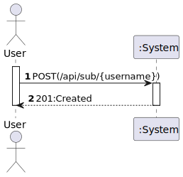
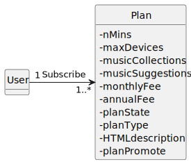
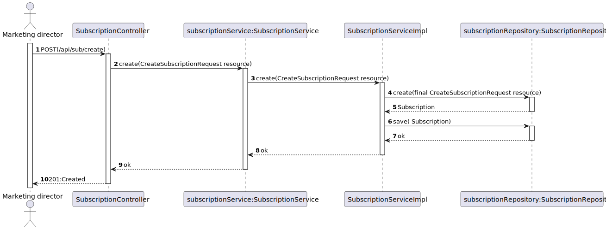
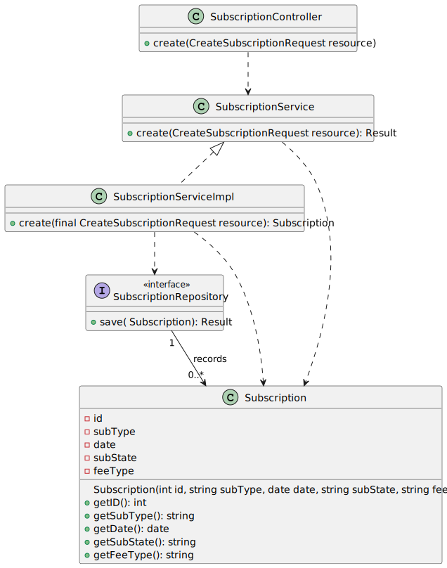

# US 07 - Subscribe to a plan.

## 1. Requirements Engineering

### 1.1. User Story Description

As a new customer I want to subscribe to a plan

  ### 1.2. Customer Specifications and Clarifications 
  **From the specifications document:**
  >"A customer can subscribe to the service by selecting a plan and paying for the annual or monthly fee. This
  entitles the customer to listen to up to n minutes of music on the number of devices according to the plan
  they selected. Other features are also dependent on the selected plan."
  
  
  
   **From the client clarifications:**
  > **Question:** Gostaria de saber se o cliente quando se regista fica logo com a subscrição free?
  > 
  > **Answer:** Idealmente o registo de clientes é feito no mesmo instante da subscrição (US 7. As a new customer I want to subscribe to a plan). se por algum motivo quiserem ou necessitarem de separar o registo de utilizador da subscrição, no momento do registo o cliente não ficará com nenhum plano subscrito
  

### 1.3. Acceptance Criteria

* **AC1:** All required data must be filled.

### 1.4. Found out Dependencies

### 1.5 Input and Output Data

**Input Data:**
* Typed data:
  * Username 
  * Password
  * Full name
  * photo/avatar (optional)
  

* Selected data:
  * Plan Type 
  * Fee Type

**Output Data:**

* Success or Unsuccess of the operation

### 1.6. System Sequence Diagram (SSD)

## 2. OO Analysis

### 2.1. Relevant Domain Model Excerpt 

## 3. Design - User Story Realization 

## 3.1. Sequence Diagram (SD)

## 3.2. Class Diagram (CD)

# 4. Tests 

**Test 1:**  Ensure PlanType Must Not Be Null

    @Test
    void ensurePlanTypeMustNotBeNull() {
    assertThrows(IllegalArgumentException.class, () -> new Subscription(null, "tiago", "Monthly"));
    }
**Test 2:**  Ensure PlanType Must Not Be Blank

    @Test
    void ensurePlanTypeMustNotBeBlank() {
        assertThrows(IllegalArgumentException.class, () -> new Subscription("", "tiago", "Annual"));
    }
**Test 3:**  Ensure PlanType Must Not Be Blank Spaces
    
    @Test
    void ensurePlanTypeMustNotBeBlankSpaces() {
        assertThrows(IllegalArgumentException.class, () -> new Subscription("   ", "tiago", "Monthly"));
    }
**Test 4:**  Ensure Subscription Attributes is Set

    @Test
    void ensureSubscriptionAttributesSet() {
        final var subject = new Subscription("Silver", "tiago", "Monthly");

        assertEquals("Silver", subject.getPlanType());
        assertEquals("tiago", subject.getUsername());
        assertEquals("Monthly", subject.getFeeType());

    }

# 5. Tests - Postman 

**Test 1:**  Create subscription

    pm.test(
    function(){
    pm.response.to.have.status(201);
    }
    );

**Test 2:**  Trying to make a subscription with a deactivated plan  
    
    pm.test(
    function(){
    pm.response.to.have.status(500);
    }
    );

**Test 3:** Login To make a Plan

    pm.test("Authtenticates", function(){

    pm.response.to.have.status(200);

    let token = postman.getResponseHeader("Authorization");
    pm.environment.set("token", token);    
    });