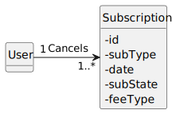

# US 08 - Cancel subscription

As subscriber, I want to cancel my subscription

## 1. Requirements Engineering
### 1.1. User Story Description

As subscriber, I want to cancel my subscription

### 1.2. Customer Specifications and Clarifications

**From the client clarifications:**
> **Question:** Boa tarde, gostaria de saber se um cliente que queira anular a sua subscrição precisa de dar alguma confirmação, como introduzir a password, por exemplo.
Cumprimentos.

> **Answer:** boa tarde,
não é necessário. essa confirmação é da responsabilidade da aplicação de UI que não faz parte do âmbito do projeto

> **Question:** Boa noite,
Relativamente à US08, o cancelamento de uma subscrição implica ou não removê-la do sistema?

> **Answer:** bom dia,
o cancelamento de uma subscrição implica que o utilizador deixa de ter acesso ao serviço. o sistema deve manter a informação da conta durante 30 dias caso o cliente a pretenda reativar. após esse período todos os dados pessoais devem ser anonimizados mas a restante informação mantida para efeitos estatisticos 

### 1.3. Acceptance Criteria

* **AC1:** All required data must be filled.

### 1.4. System Sequence Diagram (SSD)

## 2. OO Analysis

### 2.1. Relevant Domain Model Excerpt 

## 3. Design - User Story Realization

## 3.1. Sequence Diagram (SD)

## 3.2. Class Diagram (CD)

# 4. Tests 

**Test 1:**  Ensure PlanType Must Not Be Null

    @Test
    void ensurePlanTypeMustNotBeNull() {
    assertThrows(IllegalArgumentException.class, () -> new Subscription(null, "tiago", "Monthly"));
    }
**Test 2:**  Ensure PlanType Must Not Be Blank

    @Test
    void ensurePlanTypeMustNotBeBlank() {
        assertThrows(IllegalArgumentException.class, () -> new Subscription("", "tiago", "Annual"));
    }
**Test 3:**  Ensure PlanType Must Not Be Blank Spaces

    @Test
    void ensurePlanTypeMustNotBeBlankSpaces() {
        assertThrows(IllegalArgumentException.class, () -> new Subscription("   ", "tiago", "Monthly"));
    }
**Test 4:**  Ensure Subscription Attributes is Set

    @Test
    void ensureSubscriptionAttributesSet() {
        final var subject = new Subscription("Silver", "tiago", "Monthly");

        assertEquals("Silver", subject.getPlanType());
        assertEquals("tiago", subject.getUsername());
        assertEquals("Monthly", subject.getFeeType());

    } 

# 5. Tests-Postman

**Test 1:**  Cancel a sub

    pm.test(
    function(){
    pm.response.to.have.status(200);
    }
    );

**Test 2:**  Verify tha sub is cancelled

    pm.test(
    function(){
    pm.response.to.have.status(200);
    }
);
pm.test("Check attribute subState", function() {
var jsonData = pm.response.json();

    var expectedDate = "2023-05-23";
    var expectedSubState = "Cancelled";
    var expectedFeeType = "Monthly";
    var expectedPlanType = "Silver";
    var expectedUsername = "admin@mail.com";
    var targetSubId = 8;

    var targetSub = jsonData;

        pm.expect(targetSub.date).to.eql(expectedDate);
        pm.expect(targetSub.subState).to.eql(expectedSubState);
        pm.expect(targetSub.feeType).to.eql(expectedFeeType);
        pm.expect(targetSub.planType).to.eql(expectedPlanType);
        pm.expect(targetSub.username).to.eql(expectedUsername);

    });

**Test 3:**  Cancel the same sub

    pm.test(
    function(){
    pm.response.to.have.status(404);
    }
);