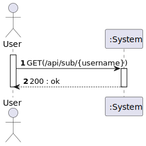
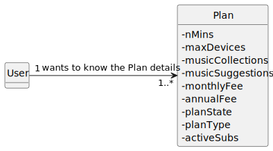
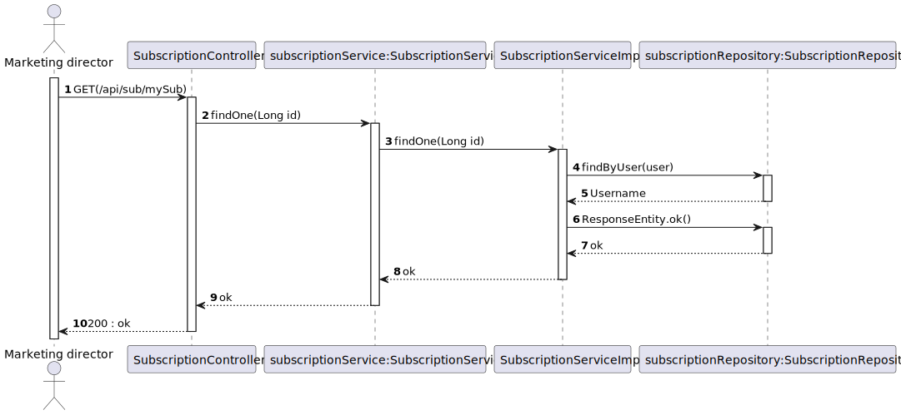
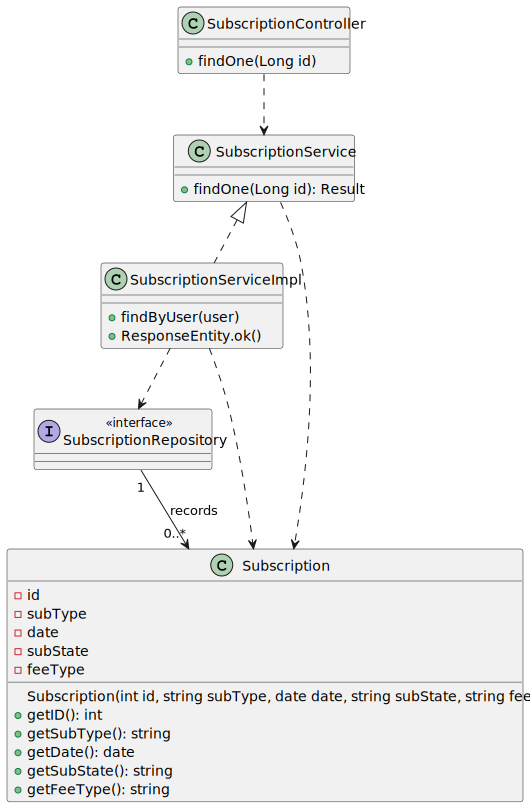

# US 09 -Details of plan

As subscriber, I want to know the details of my plan

## 1. Requirements Engineering

### 1.2. Customer Specifications and Clarifications

### 1.3. Acceptance Criteria

* **AC1:** All required data must be filled.

### 1.4. Found out Dependencies

* To see all the details, we should have at least 1 subscription in our database

### 1.5 Input and Output Data

**Output Data:**

* Shows plan details

### 1.6. System Sequence Diagram (SSD)

## 2. OO Analysis

### 2.1. Relevant Domain Model Excerpt 

## 3. Design - User Story Realization 

### Systematization ##

## 3.1. Sequence Diagram (SD)

## 3.2. Class Diagram (CD)

# 4. Tests 

**Test 1:** Ensure Patch feeType

    @Test
    void ensurePatchfeeType() {
    final var patch = new EditSubscriptionRequest("Monthly" , "Silver");

        final var subject = new Subscription("Silver", "tiago", "Monthly");

        subject.applyPatch(0, patch.getPlanType(), patch.getFeeType());

        assertEquals("Monthly", subject.getFeeType());
    }

**Test 2:** Ensure Patch plantype

    @Test
    void ensurePatchplantype() {
        final var patch = new EditSubscriptionRequest("Annual" , "Silver");

        final var subject = new Subscription("Silver", "tiago", "Annual");

        subject.applyPatch(0, patch.getPlanType(), patch.getFeeType());

        assertEquals("Silver", subject.getPlanType());
    }

# 5. Tests-Postman 

**Test 1:** Get the details of my plan

    pm.test(
    function(){
    pm.response.to.have.status(200);
    }
    );