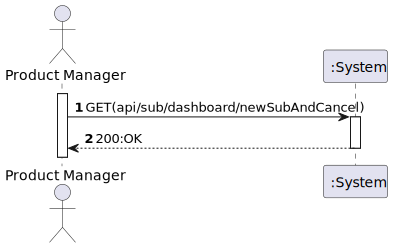
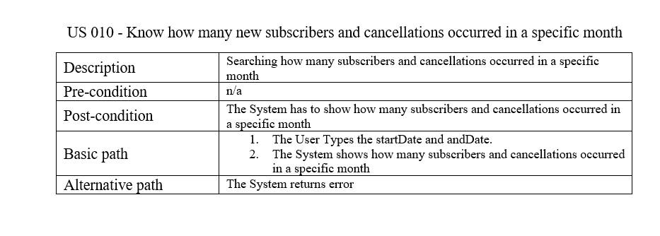
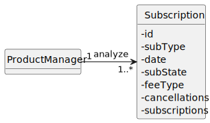
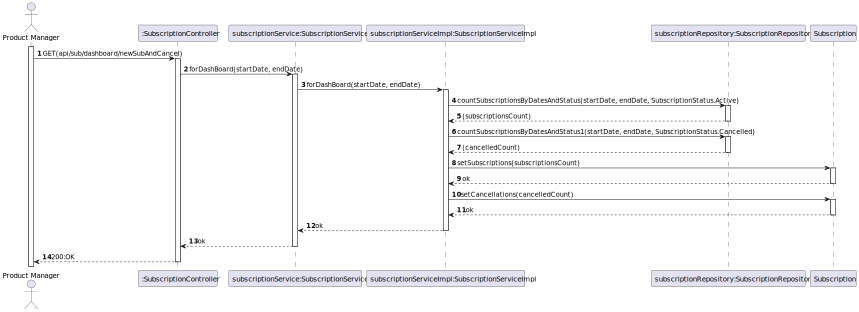
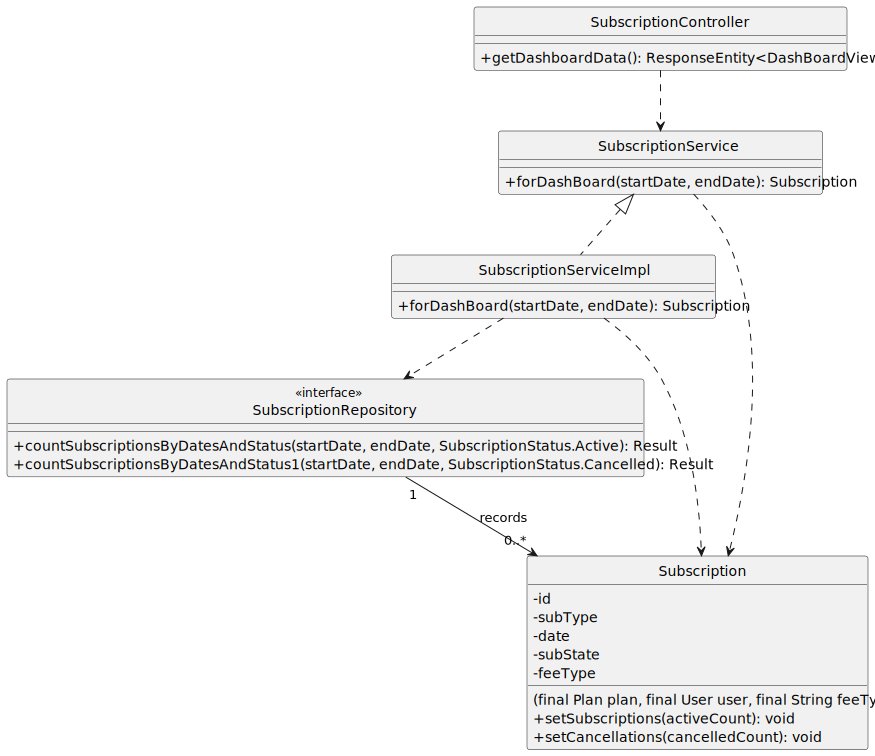

# US 010 - Know how many new subscribers and cancellations occurred in a specific month

## 1. Requirements Engineering

### 1.1. User Story Description

- As Product Manager I want to know how many new subscribers and cancellations occurred in a specific month.

### 1.2. Customer Specifications and Clarifications

**From the specifications document:**

> n/a
> 
**From the client clarifications:**

> **Question:** O staff poderá escolher ver as subscrições e os cancelamentos individualmente, ou deverão ser mostrados os dois juntos?
>
> **Answer:** Pretende-se que o retorno deste serviço seja uma estrutura de dados que possa trazer toda a informação desejada pelo utilizador, o que implica que será possivel consultar essas duas informações em simultaneo. deve no entanto ser possivel filtrar essa informação para indicar ao serviço que apenas se pretende uma delas e entre que datas.

> **Question:** Quais são os critérios de aceitação para saber quantos subscribers e cancellations ocorreram num mês específico. Há algumas informações/dados em especifico que devo ter mais atenção?
>
> **Answer:** supondo que num dado mês aconteceu o seguinte:
subscritor 123 cancelou a sua subscrição
novo subscritor 456
novo subscritor 457
o dashboard deve mostrar:
cancelamentos: 1
novas subscrições: 2

> **Question:** No que diz respeito à informação que é recebida, podemos apresentar apenas o número de subscrições novas e canceladas ou devemos também indicar quais planos foram subscritos ou cancelados no mês especificado pelo utilizador.
>
> **Answer:** Basta indicarem as quantidades

> **Question:** Olá boa-tarde,
As pesquisas feitas pelo Project Manager da Dashboard são para ser guardadas?
Cumprimentos,
Martim Oliveira
>
> **Answer:**
bom dia,
não

> **Question:**
Boa noite,
Uma renovaçao de uma subscriçao pode ser considerada uma nova subscriçao?Se não como fazemos a distinção de novos subscritores e de subscritores que renovam a sua subscriçao

>
> **Answer:** bom dia,
pretende-se distinguir novas subscrições de renovações. Como tal para cada subscrição é necessário saber a data em que foi subscrita e a última data em que foi renovada.

### 1.3. Acceptance Criteria

* A subscription must exist in the database.

### 1.4. Found out Dependencies

* To see all the new subscriptions and cancellations, we should have at least 1 subscription in our database

### 1.5 Input and Output Data

**Input Data:**

* Typed data:
  * a month

* Selected data:
  * n/a

**Output Data:**

* All new subscriptions and cancellations in that specific month

### 1.6. System Sequence Diagram (SSD)

### 1.7. Functionality

### 1.8 Other Relevant Remarks

n/a

## 2. OO Analysis

### 2.1. Relevant Domain Model Excerpt

### 2.2. Other Remarks

n/a

## 3. Design

## 3.1. Sequence Diagram (SD)

## 3.2. Class Diagram (CD)

# 4. Tests

# 5. Observations

*n/a*

