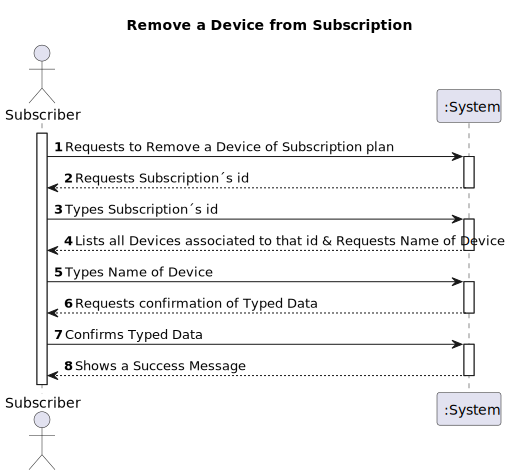
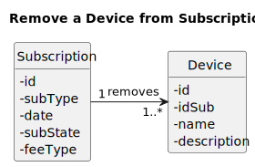
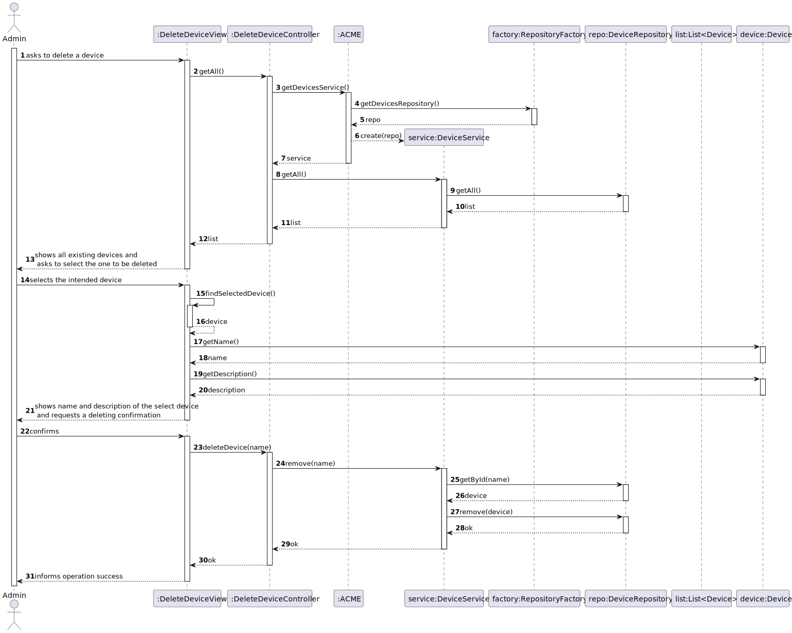
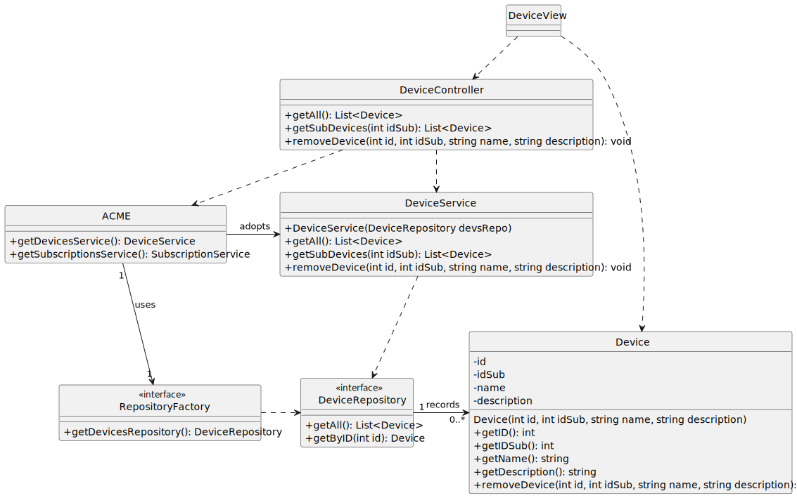

# US 012 - As subscriber I want to remove a device from my subscription

## 1. Requirements Engineering

### 1.1. User Story Description

*"As subscriber I want to remove a device from my subscription."*

### 1.2. Customer Specifications and Clarifications 

**From the specifications document:**

> "A customer can subscribe to the service by selecting a plan and paying for the annual or monthly fee. This entitles the customer to listen to up to n minutes of music on the number of devices according to the plan they selected."

**From the client clarifications:**

> **Question#1:** "... Gostaria de saber se um único dispositivo pode estar associado a 2 ou mais contas geridas por utilizadores diferentes."
>
> **Answer#1:** "...um dispositivo está associado com uma unica subscrição"

> **Question#2:** "... existe algum número limite de dispositivos associado a cada subscritor ? Se sim, esse número depende do plano atual do subscritor ?"
>
> **Answer#2:** "...essa é uma caracteristica do plano e definida aquando da criação do plano."

> **Question#3:** "No que respeita adicionar/remover dispositivos a/de uma subscrição devemos considerar estas operações como criar e apagar, respetivamente, um dispositivo, ou se o objetivo é penas (des)associar o dispositivo a uma subscrição. Por exemplo, ao remover um dispositivo de uma subscrição estamos a apagá-lo ou a alterar o seu estado para que não esteja associado a uma subscrição? Com isto gera-se também a seguinte questão: um dispositivo está associado a uma subscrição ou a um utilizador?"
>
> **Answer#3:** "...de um ponto de vista funcional, remover um dispoisitivo corresponde a remover esse dispositivo do sistema, "esquece-lo", "apaga-lo", para que não seja mais reconhecido. Se de um ponto de vista tecnologico ou não funcional pretenderem fazer um "soft delete" é uma decisão técnica da equipa que como qualquer outra deve ser documentada e justificada no documento de design. em relação à segunda pergunta, foi respondida noutro post"

> **Question#5:** "...Numa pergunta anterior, referiu que o utilizador necessita de inserir o MAC address e a designação do dispositivo. Na US 13 - (As subscriber I want to update the details of my device (name and description)), o "name" e a "description" referem-se ao MAC address e a designação respetivamente?"
>
> **Answer#5:** "..."MAC address" é o endereço da placa de rede do dispositivo: https://en.wikipedia.org/wiki/MAC_address
"name" é o nome que o tulizador dá ao dispositivo, ex., "TV 1 sala"
"description" é um texto que o utilizaod rpode introiduzir para descrever melhor o dispositivo, ex., "TV grande na parede da sala""
> 
### 1.3. Acceptance Criteria

> All fields must be filled in when inserting the requested data.

### 1.4. Found out Dependencies

n/a

### 1.5 Input and Output Data

**Input Data**
* **Typed Data:**
  *macAddress.*

* **Selected Data:**
  *name.*

**Output Data**
* **Output Data:**
  *204:No Content.*

### 1.6. System Sequence Diagram (SSD)

### 1.7 Functionality

### 1.8 Other Relevant Remarks

n/a

## 2. OO Analysis

### 2.1. Relevant Domain Model Excerpt

### 2.2. Other Remarks

n/a

## 3. Design - User Story Realization 

## 3.1. Sequence Diagram (SD)

## 3.2. Class Diagram (CD)

# 4. Tests 

**Test 1:** Ensure macAddress is not null

   	@Test
    void ensureMacAddressMustNotBeNull() {
        assertThrows(IllegalArgumentException.class, () -> new Device(subscription,null,"Tv Sala", "Tv 4K"));
    }

**Test 2:** Ensure macAddress is not blank

    @Test
    void ensureMacAddressMustNotBeBlank() {
        assertThrows(IllegalArgumentException.class, () -> new Device(subscription,"","Tv Sala", "Tv 4K"));
    }

**Test 3:** Ensure macAddress does not have blank spaces

    @Test
    void ensureMacAddressMustNotBeBlankSpaces() {
        assertThrows(IllegalArgumentException.class, () -> new Device(subscription,"   ", "Tv Sala", "Tv 4k"));
    }

**Test 4:** Ensure name is not null

    @Test
    void ensureNameMustNotBeNull() {
        assertThrows(IllegalArgumentException.class, () -> new Device(subscription,"56-44-D6-7B-86-23",null, "Tv 4K"));
    }

**Test 5:** Ensure name is not blank

    @Test
    void ensureNameMustNotBeBlank() {
        assertThrows(IllegalArgumentException.class, () -> new Device(subscription,"56-44-D6-7B-86-23","", "Tv 4K"));
    }

**Test 6:** Ensure name does not have blank spaces

    @Test
    void ensureNameMustNotBeBlankSpaces() {
        assertThrows(IllegalArgumentException.class, () -> new Device(subscription,"56-44-D6-7B-86-23", "   ", "Tv 4k"));
    }

**Test 7:** Ensure description is not null

    @Test
    void ensureDescriptionMustNotBeNull() {
        assertThrows(IllegalArgumentException.class, () -> new Device(subscription,"56-44-D6-7B-86-23","Tv Sala", null));
    }

**Test 8:** ensure description is not blank

    @Test
    void ensureDescriptionMustNotBeBlank() {
        assertThrows(IllegalArgumentException.class, () -> new Device(subscription,"56-44-D6-7B-86-23","", ""));
    }

**Test 9:** Ensure description does not have blank spaces

    @Test
    void ensureDescriptionMustNotBeBlankSpaces() {
        assertThrows(IllegalArgumentException.class, () -> new Device(subscription,"56-44-D6-7B-86-23", "Tv Sala", "   "));
    }

**Test 10:** Ensure macAddress is set

    @Test
    void ensureMacAddressIsSet() {
        final var device = new Device(subscription, "56-44-D6-7B-86-23", "Tv Sala", "Tv 4K");
        assertEquals("56-44-D6-7B-86-23", device.getMacAddress());
    }

**Test 11:** Ensure name is set

    @Test
    void ensureNameIsSet() {
        final var device = new Device(subscription, "56-44-D6-7B-86-23", "Tv Sala", "Tv 4K");
        assertEquals("Tv Sala", device.getName());
    }

**Test 12:** Ensure description is set

    @Test
    void ensureDescriptionIsSet() {
        final var device = new Device(subscription, "56-44-D6-7B-86-23", "Tv Sala", "Tv 4K");
        assertEquals("Tv 4K", device.getDescription());
    }

**Test 13:** Ensure device attributes are set

    @Test
    void ensureDeviceAttributesSet() {
        final var device = new Device(subscription, "56-44-D6-7B-86-23", "Tv Sala", "Tv 4K");
        assertEquals(subscription, device.getSubscription());
        assertEquals("56-44-D6-7B-86-23", device.getMacAddress());
        assertEquals("Tv Sala", device.getName());
        assertEquals("Tv 4K", device.getDescription());
    }

**Test 14:** Ensure macAddress has the correct syntax

    @Test
    void ensureMacAddressMustHaveSyntax() {
    assertThrows(IllegalArgumentException.class, () -> new Device(subscription,"fffffffffffffffff","Tv Sala", "Tv 4K"));
    }

**Test 15:** Ensure macAddress is valid

    @Test
    void ensureMacAddressMustBeValid() {
        assertThrows(IllegalArgumentException.class, () -> new Device(subscription,"ZZ-44-D6-7B-86-23", "Tv Sala", "Tv 4k"));
    }

# 5. Observations

*n/a*

