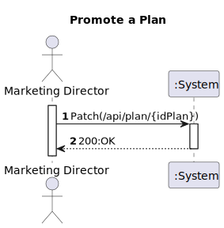
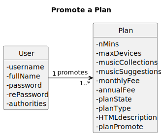
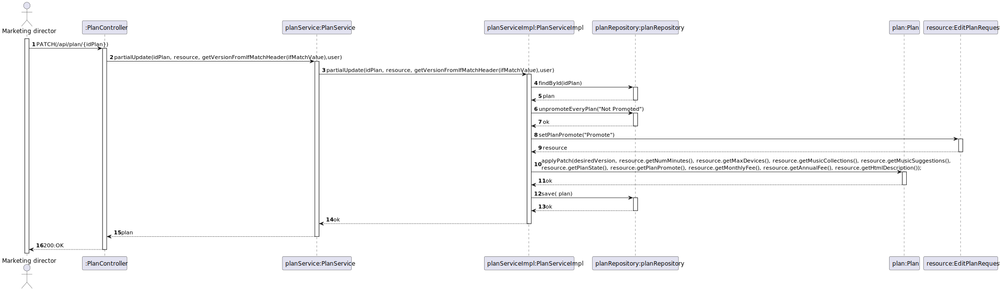
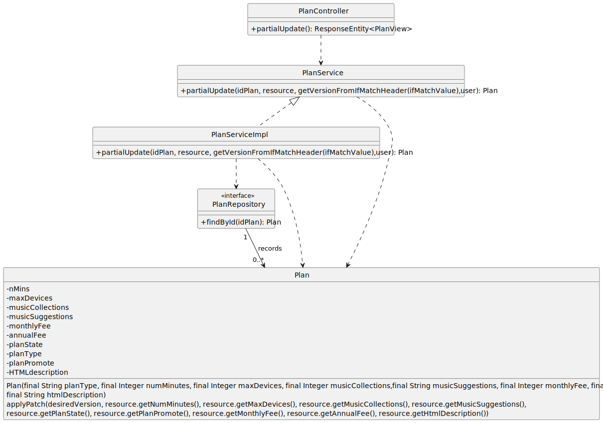

# US 020 - As marketing director, I want to promote a plan

## 1. Requirements Engineering

### 1.1. User Story Description

*"As marketing director, I want to promote a plan."*

### 1.2. Customer Specifications and Clarifications 

**From the specifications document:**

> "Due to marketing reasons, the company wants to be able to promote a plan, that is, give an highlight to a certain plan, for example, by rendering it on the web page with a different layout that gives it more screen area than the others. In the previous example, the Gold plan is the promoted plan."

**From the client clarifications:**

> **Question#1:** "... só para ter a certeza gostaria de saber se o "marketing director" é capaz de promover vários planos ou apenas exclusivamente um de cada vez, ou seja, se um plano estiver promovido os outros não podem estar."
>
> **Answer#1:** "...apenas um plano está promovido a cada momento"

### 1.3. Acceptance Criteria

> All fields must be filled in when inserting the requested data.

### 1.4. Found out Dependencies

> A plan must exist previously.

### 1.5 Input and Output Data

**Input Data**
* **Typed Data:**
  *idPlan.*

* **Selected Data:**
  *n/a.*

**Output Data**
* **Output Data:**
  *200:OK.*

### 1.6. System Sequence Diagram (SSD)

### 1.7 Functionality

### 1.8 Other Relevant Remarks

n/a

## 2. OO Analysis

### 2.1. Relevant Domain Model Excerpt

### 2.2. Other Remarks

n/a

## 3. Design - User Story Realization

### 3.1. Sequence Diagram (SD)

### 3.2. Class Diagram (CD)

# 4. Tests 

**Test 1:** Ensure planPromote is set

   	@Test
    public void testPromotePlan_ValidPromote() {
        plan.setPlanPromote("Promoted");
        Assertions.assertEquals("Promoted", plan.getPlanPromote());
    }

**Test 2:** Ensure planPromote is not set 

    @Test
    public void testPromotePlan_InvalidPromote() {
        Assertions.assertThrows(IllegalArgumentException.class, () -> {
            plan.setPlanPromote("NotPromoted");
        });
    }

**Test 3:** Ensure planPromote is not null

    @Test
    public void testPromotePlan_NullPromote() {
        Assertions.assertThrows(NullPointerException.class, () -> {
            plan.setPlanPromote(null);
        });
    }

**Test 4:** Ensure planPromote has not blank spaces

    @Test
    public void testPromotePlan_BlankPromote() {
        Assertions.assertThrows(IllegalArgumentException.class, () -> {
            plan.setPlanPromote("");
        });
    }

**Test 5:** Ensure planPromote is case sensitive

    @Test
    public void testPromotePlan_CaseSensitivePromote() {
        Assertions.assertThrows(IllegalArgumentException.class, () -> {
            plan.setPlanPromote("pRoMoTeD");
        });
    }

# 5. Observations

*n/a*

