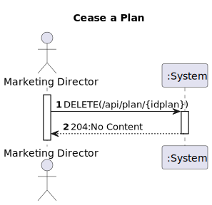
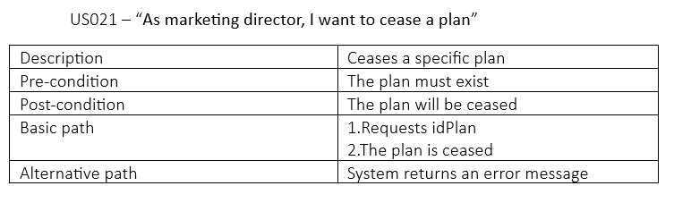
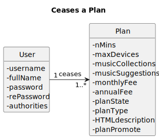
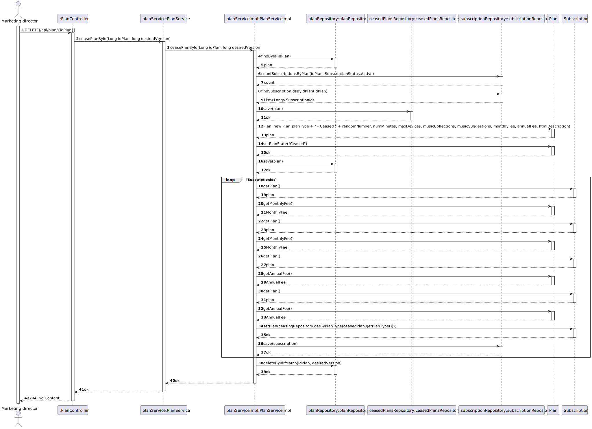
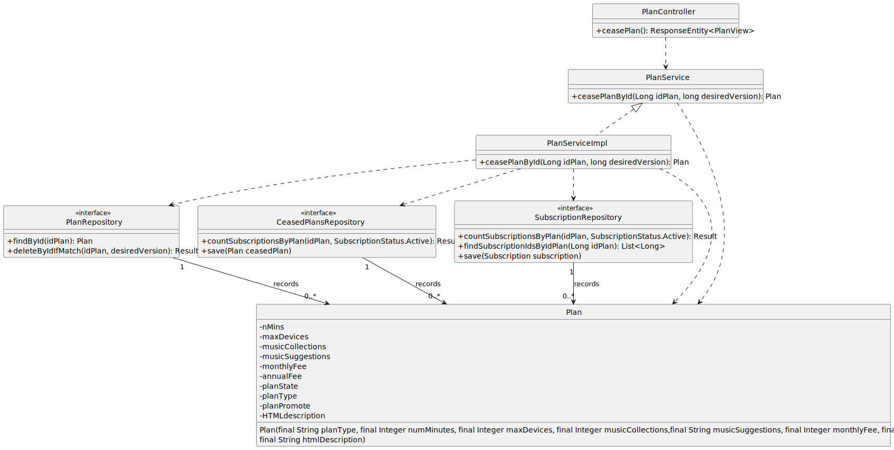

# US 021 - As marketing director, I want to cease a plan

## 1. Requirements Engineering

### 1.1. User Story Description

*"As marketing director, I want to cease a plan."*

### 1.2. Customer Specifications and Clarifications 

**From the specifications document:**

> "Plans can also be deactivated or ceased. A deactivated plan is one that no longer is available for subscription but remains inforce for current active subscribers of such plan. A plan can only be ceased if there are no current subscribers of such plan. Usually, the company migrates the subscribers to a different plan prior to ceasing it."

**From the client clarifications:**

> **Question#1:** "...Na US 21(As marketing director, I want to cease a plan.), o cliente pretende apagar o plano completamente? Se sim, pode-se apagar com subscrições ainda relacionadas ao plano que pretende realizar "cease"?"
>
> **Answer#1:** "...pretende-se que o plano seja considerado como "arquivado" deixando de aparecer nas listagens e dashboards. apenas se pode arquivar um plano que esteja inativo e que já não tenha subscrições"

> **Question#2:** "...gostaria de saber quando o "marketing director" quer parar um plano (US021) , se este plano estiver associado a subscrições canceladas se estas podem ser eliminadas do sistema ou não. Assumo que n seja possível parar um plano com subscrições ativas, mas gostaria de uma confirmação..."
>
> **Answer#2:** "ver https://moodle.isep.ipp.pt/mod/forum/discuss.php?d=23264#p29519"

### 1.3. Acceptance Criteria

> All fields must be filled in when inserting the requested data.

### 1.4. Found out Dependencies

> A plan must exist previously.

### 1.5 Input and Output Data

**Input Data**
* **Typed Data:**
  *idPlan.*

* **Selected Data:**
  *n/a.*

**Output Data**
* **Output Data:**
  *204:No Content.*

### 1.6. System Sequence Diagram (SSD)

### 1.7 Functionality

### 1.8 Other Relevant Remarks

n/a

## 2. OO Analysis

### 2.1. Relevant Domain Model Excerpt

### 2.2. Other Remarks

n/a

## 3. Design - User Story Realization

### 3.1. Sequence Diagram (SD)

### 3.2. Class Diagram (CD)

# 4. Tests 

   	

# 5. Observations

*n/a*

