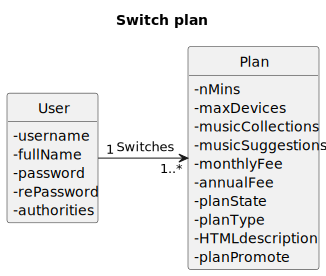

# US 022 -As a subscriber, i want to switch my plan (upgrade/downgrade)

## 1. Requirements Engineering

### 1.1. User Story Description

*"As subscriber I want to switch my plan (upgrade/downgrade)"*

### 1.2. Customer Specifications and Clarifications 

**From the client clarifications:**

> **Question#1:** "Boa Tarde, Gostaria de saber qual o critério para distinguir entre upgrade e downgrade aquando da US22 relativa à mudança de plano por parte do utilizador."
>
> **Answer#1:** "boa tarde,
o cliente pode escolher um plano diferente do seu atual. o downgrade ou upgrade terá a ver com a sua intenção e qual o plano escolhido em relação ao seu atual. de um ponto de vista funcional não há diferença."

### 1.3. Acceptance Criteria

### 1.4. Found out Dependencies

### 1.5 Input and Output Data

**Input Data**
* **Typed Data:**
  *idPlan.*

* **Selected Data:**
  *n/a.*

**Output Data**
* **Output Data:**
  *200:OK.*

### 1.6. System Sequence Diagram (SSD)

### 1.7 Functionality

### 1.8 Other Relevant Remarks

n/a

## 2. OO Analysis

### 2.1. Relevant Domain Model Excerpt

### 2.2. Other Remarks

n/a

## 3. Design - User Story Realization

### 3.1. Sequence Diagram (SD)

### 3.2. Class Diagram (CD)

# 4. Tests 

**Test 1:** Ensure patch Plan

   	@Test
    void ensurePatchPlan() {
        final var patch = new EditSubscriptionRequest("Annual" , j);

        final var subject = new Subscription(testPlan, testUser, "Annual");

        subject.applyPatch(0, patch.getFeeType());

        assertEquals(testPlan, subject.getPlan());
    }

**Test 2:** Ensure FeeType must not be blank

    @Test
    void ensureFeeTypeMustNotBeBlank() {
        assertThrows(IllegalArgumentException.class, () -> new Subscription(testPlan, testUser, ""));
    }

**Test 3:** Ensure valid FeeType

    @Test
    void ensureValidFeeType() {
        assertThrows(IllegalArgumentException.class, () -> new Subscription(testPlan, testUser, "InvalidFeeType"));
    }

# 5. Tests Postman

**Test 1:** Create a subscription with wrong values Copy

      pm.test(
    function(){
    pm.response.to.have.status(400);
    }
    );

**Test 2:** Trying to subscribe to a plan that doesn't exist Copy
    
    pm.test(
    function(){
    pm.response.to.have.status(400);
    }
    );

**Test 3:** Get the details of my plan Copy 2
    
    pm.test(
    function(){
    pm.response.to.have.status(403);
    }
    );