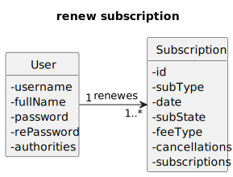

# US 023 - As subscriber I want to renew my annual subscription

## 1. Requirements Engineering

### 1.1. User Story Description

*"As subscriber I want to renew my annual subscription"*

### 1.2. Customer Specifications and Clarifications 

**From the specifications document:**

> "For instance, a future cash flow map, assuming the current monthly
subscribers will remain, and the annual subscribers will not renew"

**From the client clarifications:**

> **Question#1:** "Tendo em conta que a US23 - "As subscriber I want to renew my annual subscription" é a unica que renova subscrições, assumindo que defino a data de fim de subscrição no momento da subscrição, não existe forma de renovar as subscrições mensais? ou assumo que as subscrições mensais são sempre renovadas e apenas defino uma data de fim no momento em que o subscriber cancela?"
>
> **Answer#1:** "boa tarde,
as subscrições mensais são assumidas como renovaveis todos os meses.
no caso das subscrições anuais, assume-se que terão como data de término os 12 meses após a subscrição/renovação"

### 1.3. Acceptance Criteria

### 1.4. Found out Dependencies

### 1.5 Input and Output Data

**Input Data**
* **Typed Data:**
  *IdSubscription.*

* **Selected Data:**
  *n/a.*

**Output Data**
* **Output Data:**
  *204:No Content.*

### 1.6. System Sequence Diagram (SSD)

### 1.7 Functionality

### 1.8 Other Relevant Remarks

n/a

## 2. OO Analysis

### 2.1. Relevant Domain Model Excerpt

### 2.2. Other Remarks

n/a

## 3. Design - User Story Realization

### 3.1. Sequence Diagram (SD)

### 3.2. Class Diagram (CD)

# 4. Tests 

**Test 1:** Ensure Name is Set

    @Test
    void ensureNameIsSet() {
    final var subject = new Subscription(testPlan, testUser, "Annual");
    assertEquals(testPlan, subject.getPlan());
    }

**Test 2:** Ensure subscription attributes set

    @Test
    void ensureSubscriptionAttributesSet() {
        final var subject = new Subscription(testPlan, testUser, "Monthly");

        assertEquals(testPlan, subject.getPlan());
        assertEquals(testUser, subject.getUser());
        assertEquals("Monthly", subject.getFeeType());

    }

**Test 3:** Ensure Patch Feetype
   
    @Test
    void ensurePatchFeeType() {
        final var patch = new EditSubscriptionRequest("Monthly" , i);

        final var subject = new Subscription(testPlan, testUser, "Monthly");

        subject.applyPatch(0, patch.getFeeType());

        assertEquals("Monthly", subject.getFeeType());
    }

# 5.Tests Postman

**Test 1:** Create subscription Copy

    pm.test(
    "US07 - Create a subscription",
    function(){
    pm.response.to.have.status(201);
    }
    );

**Test 2:** Trying to create another subscription Copy

    pm.test(
    function(){
    pm.response.to.have.status(400);
    }
    );

**Test 3:** Login again to get the SUBSCRIBER status Copy

    pm.test("Authtenticates", function(){

    pm.response.to.have.status(200);

    let token = postman.getResponseHeader("Authorization");
    pm.environment.set("token", token);    
    });
    
