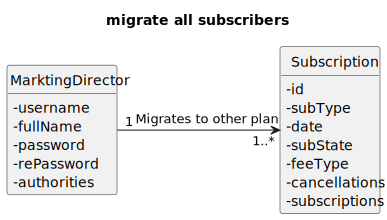

# US 024 - As marketing director, I want to migrate all subscribers of a certain plan to a different plan

## 1. Requirements Engineering

### 1.1. User Story Description

*"As marketing director, I want to migrate all subscribers of a certain plan to a different plan"*

### 1.2. Customer Specifications and Clarifications 

**From the specifications document:**

> " A plan can only be ceased if there are no current
subscribers of such plan. Usually, the company migrates the subscribers to a different plan prior to ceasing
it."

**From the client clarifications:**

> **Question#1:** "US 22 e 24 -  quando o plano do cliente é mudado, devemos apagar os devices previamente associados, sendo necessário introduzi-los outra vez ou devemos migrá-los para a nova subscrição? Uma vez que caso o plano reduza o numero max de dispositivos, poderá não ser possível manter todos os que já se encontravam associados a subscrição Se não apagarmos os devices da subscrição, como escolhemos quais devem permanecer caso haja uma redução do número máximo dos mesmos?"
>
> **Answer#1:** "boa tarde,
se o novo plano não permtiir mante ro mesmo número de dispositivos que o cliente tem atualmente não deve ser possivel realizar a troca de plano. o cliente trá que primeiro remover alguns dos seus dispositivos e depois efetuar a troca de plano"

> **Question#2:** "us 24- Quando um utilizador da upgrade/downgrade ao seu plano, o seu novo plano entra em vigor de forma imediata, ou apenas quando a sua subscrição atual terminar? Sendo que tendo efeito imediato, a sua subscrição anterior é cancelada"
>
> **Answer#2:** "
boa tarde,
tem efeito imediato"

### 1.3. Acceptance Criteria

### 1.4. Found out Dependencies

### 1.5 Input and Output Data

**Input Data**
* **Typed Data:**
  *n/a.*

* **Selected Data:**
  *n/a.*

**Output Data**
* **Output Data:**
  *204:No Content.*

### 1.6. System Sequence Diagram (SSD)

### 1.7 Functionality

### 1.8 Other Relevant Remarks

n/a

## 2. OO Analysis

### 2.1. Relevant Domain Model Excerpt

### 2.2. Other Remarks

n/a

## 3. Design - User Story Realization

### 3.1. Sequence Diagram (SD)

### 3.2. Class Diagram (CD)

# 4. Tests 

**Test 1:** Ensure set cancellations

    @Test
    void ensureSetCancellations() {
    Subscription subscription = new Subscription(testPlan, testUser, "Monthly");
    subscription.setCancellations(2);
    assertEquals(2, subscription.getCancellations());
    }

**Test 2:** Ensure set subscriptions

    @Test
    void ensureSetSubscriptions() {
        Subscription subscription = new Subscription(testPlan, testUser, "Monthly");
        subscription.setSubscriptions(5);
        assertEquals(5, subscription.getSubscriptions());
    }

**Test 3:** Ensure set user

    @Test
    void ensureSetUser() {
        User newUser = new User("newuser@mail.com", "NewUser123", "New User");
        Subscription subscription = new Subscription(testPlan, testUser, "Monthly");
        subscription.setUser(newUser);
        assertEquals(newUser, subscription.getUser());
    }

# 5. Tests Postman

**Test 1:** Trying to create another subscription Copy

    pm.test(
    function(){
    pm.response.to.have.status(403);
    }
    );

**Test 2:** Get the details of my plan Copy
  
    pm.test(
    function(){
    pm.response.to.have.status(200);
    }
    );

**Test 3:** Cancel a sub Copy

    pm.test(
    function(){
    pm.response.to.have.status(200);
    }
    );  
