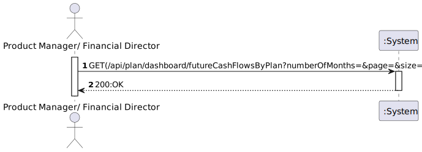

# US 025 - As Product Manager or Financial director, I want to know the future cashflows for the upcoming n months filtered/broken down by plan

## 1. Requirements Engineering

### 1.1. User Story Description

*"As Product Manager or Financial director, I want to know the future cashflows for the upcoming n months filtered/broken down by plan"*

### 1.2. Customer Specifications and Clarifications 

**From the specifications document:**

> ""

**From the client clarifications:**

> **Question#1:** "O filtro por plano num pedido de cashflow em n meses pode ser nulo (ou seja calcular o cashflow para todos os planos) ou é sempre necessário filtrar por um plano em especifico ?"
>
> **Answer#1:** "o filtro por plano deve ser opcional. nesse caso deverá apresentar todos os planos"

### 1.3. Acceptance Criteria

### 1.4. Found out Dependencies

### 1.5 Input and Output Data

**Input Data**
* **Typed Data:**
  *numberOfMonths.*

* **Selected Data:**
  *n/a.*

**Output Data**
* **Output Data:**
  *200:OK*

### 1.6. System Sequence Diagram (SSD)

### 1.7 Functionality

### 1.8 Other Relevant Remarks

n/a

## 2. OO Analysis

### 2.1. Relevant Domain Model Excerpt

### 2.2. Other Remarks

n/a

## 3. Design - User Story Realization

### 3.1. Sequence Diagram (SD)

### 3.2. Class Diagram (CD)

# 4. Observations

*n/a*

