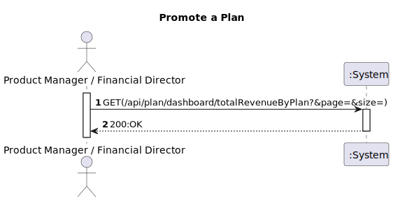
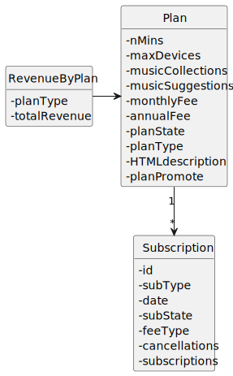

# US 026 - As Product Manager or Financial director, I want to know the year-to-date revenue of my company filtered/broken down by plan

## 1. Requirements Engineering

### 1.1. User Story Description

*"As marketing director, I want to change the pricing of a plan"*

### 1.2. Customer Specifications and Clarifications 

**From the specifications document:**

> ""

**From the client clarifications:**

> **Question#1:** "Na US 26 é apenas pedido o rendimento do ano atual até à data atual(01/01/2023-01/06/2023) ou é necessário o utilizador especificar um ano para começar a calcular os rendimentos(01/01/2020-01/06/2023)?"
>
> **Answer#1:** "apenas do ano atual"

> **Question#2:** "gostava de saber na US26 quais informacões devem ser apresentadas ao cliente. Tb gostava de saber se apenas o cliente tem que por o ano que quer ver essas informacões ou se é do ano em que está atualmente , a começar em janeiro até á data que se encontra. "
> 
> **Answer#3:** "deve ser apresentada a receita proveniente das subscrições, devidamente subdividida por plano. apenas do ano corrente"

### 1.3. Acceptance Criteria

### 1.4. Found out Dependencies

### 1.5 Input and Output Data

**Input Data**
* **Typed Data:**

* **Selected Data:**
  *n/a.*

**Output Data**
* **Output Data:**
  *200:OK*

### 1.6. System Sequence Diagram (SSD)

### 1.7 Functionality

### 1.8 Other Relevant Remarks

n/a

## 2. OO Analysis

### 2.1. Relevant Domain Model Excerpt

### 2.2. Other Remarks

n/a

## 3. Design - User Story Realization

### 3.1. Sequence Diagram (SD)

### 3.2. Class Diagram (CD)

# 4. Observations

*n/a*

