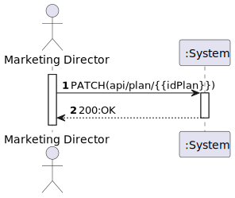
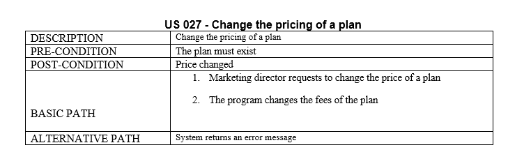
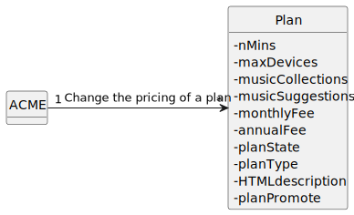
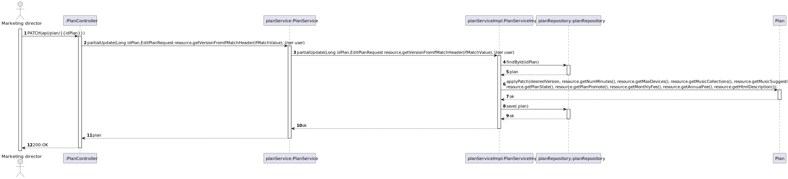

# US 027 - Change the pricing of a plan

## 1. Requirements Engineering

### 1.1. User Story Description

*"As marketing director, I want to change the pricing of a plan"*

### 1.2. Customer Specifications and Clarifications 

**From the specifications document:**

> "... changes in prices of the plan during the period."

**From the client clarifications:**

> **Question#1:** "
Bom dia,
No work package quando é feito uma alteração ao preço do plan (As marketing director, I want to change the pricing of a plan) é preciso também guardar a data de alteração e depois mostrar (As marketing director, I want to know the price change history of a plan)?
Cumprimentos"
>
> **Answer#1:** "boa tarde, sim"
> 
> **Question#2:** "
Boa tarde, gostaria de saber se existem criterios de aceitaçao para as US's  27 e 28
Cumprimentos"
>
> **Answer#2:** "
boa tarde,
o utilizador deve poder alterar o preço de um plano devendo o sistema guardar essa informação para posteriormente poder listar em que data o preço foi alterado, por quem e para que valor."

### 1.3. Acceptance Criteria

### 1.4. Found out Dependencies

### 1.5 Input and Output Data

**Input Data**
* **Typed Data:**
  *monthlyFee,*
  *annualFee,*
  *planId*

* **Selected Data:**
  *n/a.*

**Output Data**
* **Output Data:**
  *200:OK*

### 1.6. System Sequence Diagram (SSD)

### 1.7 Functionality

### 1.8 Other Relevant Remarks

n/a

## 2. OO Analysis

### 2.1. Relevant Domain Model Excerpt

### 2.2. Other Remarks

n/a

## 3. Design - User Story Realization

### 3.1. Sequence Diagram (SD)

### 3.2. Class Diagram (CD)

# 4. Tests 

**Test 1:** Change the price of a plan (invalid values)

        pm.test(
            function(){
              pm.response.to.have.status(400);
            }
        );
**Test 2:** Change the price of a plan (oK)

        pm.test(
            function(){
             pm.response.to.have.status(200);
            }
        );

# 5. Observations

*n/a*

